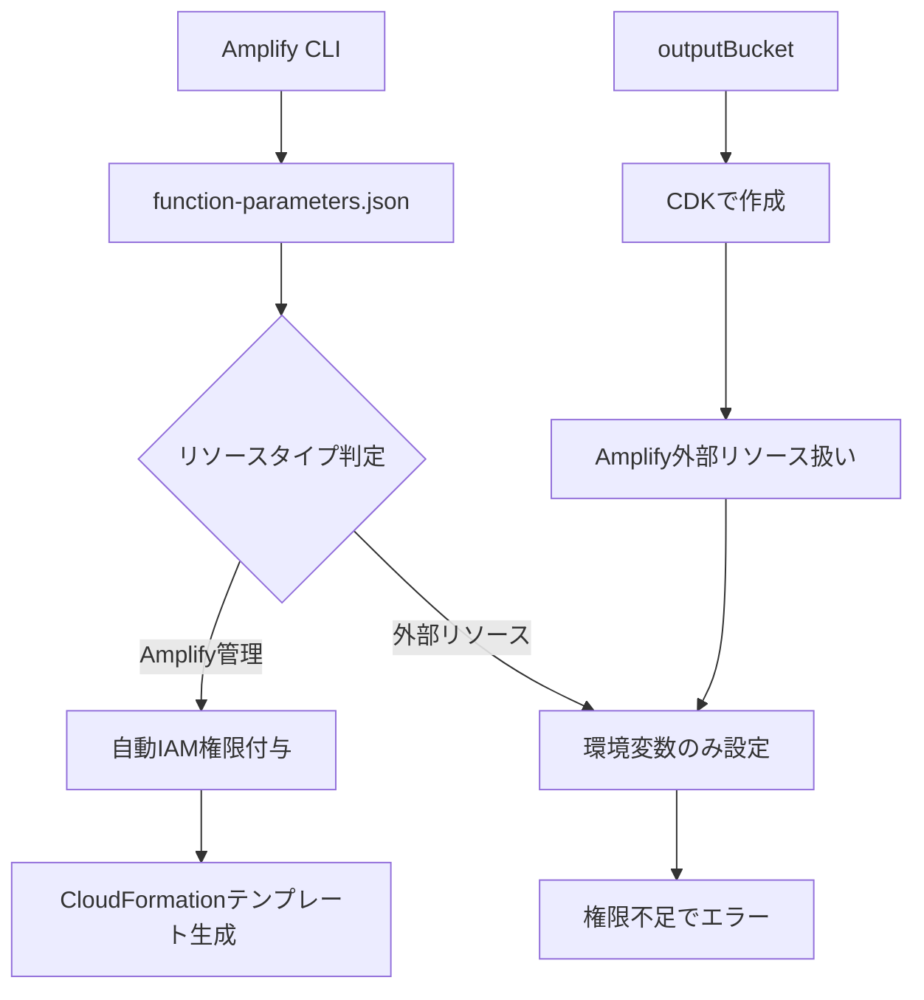

# OutputBucket権限問題 - 現状分析と解決策

## 1. 問題の概要

### 発生している問題
- `cleanupExpiredFiles` Lambda関数が出力バケット（`transcriptminute-output-0148238a949-internal`）に対する削除権限を持っていない
- `deleteGeneratedFiles` Lambda関数も同様の問題を抱えている
- 入力バケット（`transcriptminutee59b87753a5a45619813e746bd1335d8a949-internal`）への権限は正常に付与されている

### 影響範囲
- **scheduled file cleanup機能**: 出力バケット内のファイルが削除できない
- **既存のfile deletion機能**: 出力バケット内のファイルが削除できない
- **データセキュリティ**: 機密ファイルが意図した期間を超えて残存するリスク

## 2. 現状の権限設定状況

### ✅ 正常に動作している権限

#### cleanupExpiredFiles-internal
```json
{
  "Action": ["s3:DeleteObject"],
  "Resource": ["arn:aws:s3:::transcriptminutee59b87753a5a45619813e746bd1335d8a949-internal/*"],
  "Effect": "Allow"
}
```

#### deleteGeneratedFiles-internal
```json
{
  "Action": ["s3:DeleteObject"],
  "Resource": ["arn:aws:s3:::transcriptminutee59b87753a5a45619813e746bd1335d8a949-internal/*"],
  "Effect": "Allow"
}
```

### ❌ 欠落している権限

**両関数とも以下の権限が付与されていない:**
```json
{
  "Action": [
    "s3:DeleteObject",
    "s3:DeleteObjects", 
    "s3:ListBucket"
  ],
  "Resource": [
    "arn:aws:s3:::transcriptminute-output-0148238a949-internal",
    "arn:aws:s3:::transcriptminute-output-0148238a949-internal/*"
  ]
}
```

## 3. 根本原因の分析

### AWS Amplify Gen 1の仕様制限

#### 自動権限付与される範囲
- **Amplify管理リソース**: `function-parameters.json`の`permissions.storage`で指定されたリソース
- **例**: `s31d11b5d9` (入力バケット) → 自動的にIAM権限が付与される

#### 自動権限付与されない範囲  
- **カスタムS3バケット**: Amplify外で作成されたリソース
- **例**: `outputBucket` (CDKで作成) → IAM権限が自動付与されない

### 設定ファイルの比較分析

#### function-parameters.json設定
```json
{
  "permissions": {
    "storage": {
      "s31d11b5d9": ["delete"],           // ✅ 権限付与される
      "Organization:@model(appsync)": ["read"],
      "ProcessingSession:@model(appsync)": ["read", "update"]
    }
  },
  "environmentVariableList": [
    {
      "cloudFormationParameterName": "storageOutputbucketBucketname",
      "environmentVariableName": "STORAGE_OUTPUTBUCKET_BUCKETNAME"  // ❌ 環境変数のみ
    }
  ]
}
```

#### CloudFormationテンプレート生成結果
- **入力バケット権限**: 自動的にIAMポリシーに含まれる
- **出力バケット権限**: CloudFormationテンプレートに含まれない
- **環境変数**: 正しく設定される

### アーキテクチャ上の要因



## 4. 他システムとの比較

### 正常動作する関数例
- `transcriptionProcessor`: 入力バケットのみ使用
- `generationWorker`: AppSync経由でのデータアクセスのみ
- `getAudioPresignedUrl`: 読み取り専用アクセス

### 問題を抱える関数の共通点
- **入力バケット + 出力バケット** 両方にアクセスが必要
- **削除権限** が必要
- **バッチ処理** を実行

## 5. 解決策の提案

### 🏆 推奨解決策: S3バケットポリシー設定

#### メリット
- **確実性**: 最も直接的で確実な権限付与方法
- **保守性**: Amplify CLI操作に依存しない
- **柔軟性**: 細かい権限制御が可能
- **一元管理**: バケット側で権限を管理

#### 実装内容
```json
{
  "Version": "2012-10-17",
  "Statement": [
    {
      "Sid": "AllowAmplifyLambdaAccess",
      "Effect": "Allow",
      "Principal": {
        "AWS": [
          "arn:aws:iam::006985033268:role/transcriptminuteLambdaRoleae9c28ef-internal",
          "arn:aws:iam::006985033268:role/transcriptminuteLambdaRole44faa12e-internal"
        ]
      },
      "Action": [
        "s3:DeleteObject",
        "s3:DeleteObjects",
        "s3:ListBucket"
      ],
      "Resource": [
        "arn:aws:s3:::transcriptminute-output-0148238a949-internal",
        "arn:aws:s3:::transcriptminute-output-0148238a949-internal/*"
      ]
    }
  ]
}
```

### 🔄 代替案: amplify update function

#### メリット  
- Amplify標準の設定方法
- バージョン管理対象となる

#### デメリット
- カスタムリソースとしての追加が必要
- 設定の複雑性
- 成功が保証されない

## 6. 実装手順

### Phase 1: バケットポリシー設定

1. **Lambda実行ロールARN確認**
   ```bash
   aws lambda get-function --function-name cleanupExpiredFiles-internal --query 'Configuration.Role'
   aws lambda get-function --function-name deleteGeneratedFiles-internal --query 'Configuration.Role'
   ```

2. **S3コンソールでバケットポリシー設定**
   - S3コンソール → `transcriptminute-output-0148238a949-internal`
   - 「アクセス許可」タブ → 「バケットポリシー」→ 「編集」
   - 上記JSONポリシーを設定

3. **権限テスト実行**
   - Lambda関数の手動実行
   - CloudWatchログでエラー確認

### Phase 2: 動作確認

1. **cleanupExpiredFiles関数テスト**
2. **deleteGeneratedFiles関数テスト**  
3. **エラーログ監視**

## 7. リスク評価

### 🔴 高リスク: 対処しない場合
- **データ漏洩リスク**: 機密ファイルの長期残存
- **コスト増加**: 不要ファイルによるストレージ費用
- **コンプライアンス違反**: データ保護規則への抵触

### 🟡 中リスク: 不適切な対処
- **過度な権限付与**: 最小権限の原則に反する
- **設定ミス**: 意図しないアクセス拒否

### 🟢 低リスク: 推奨対処法
- **適切な権限範囲**: 削除操作のみに限定
- **監査可能**: CloudTrailで操作追跡可能

## 8. 今後の課題と改善点

### 短期的改善 (1-2週間)
- [ ] バケットポリシー設定の実装
- [ ] 両Lambda関数の動作確認
- [ ] 権限設定の文書化

### 中期的改善 (1-2ヶ月)  
- [ ] Amplify Gen 2への移行検討
- [ ] 権限管理の標準化
- [ ] 監視・アラート設定の強化

### 長期的改善 (3-6ヶ月)
- [ ] セキュリティ監査の実施
- [ ] アーキテクチャの見直し
- [ ] 自動化の拡張

## 9. 関連リソース

### 技術文書
- [AWS S3 Bucket Policies](https://docs.aws.amazon.com/s3/latest/userguide/bucket-policies.html)
- [AWS Amplify Gen 1 Custom Resources](https://docs.amplify.aws/gen1/javascript/build-a-backend/storage/import/)

### 本プロジェクト関連
- `tasks/0.2.x/scheduled_file_cleanup_implementation_plan.md`
- `tasks/0.2.x/scheduled_file_cleanup_implementation_checklist.md`
- `amplify/backend/custom/outputBucket/cdk-stack.ts`

## 10. 最終解決方法 ✅

### 実装された解決策: custom-policies.json設定

**結果**: 当初推奨していたS3バケットポリシー設定ではなく、**各Lambda関数の`custom-policies.json`に直接権限を記述**することで問題が解決しました。

#### 実装内容

**cleanupExpiredFiles/custom-policies.json**
```json
[
  {
    "Action": [
      "s3:ListBucket", 
      "s3:GetObject", 
      "s3:PutObject",
      "s3:DeleteObject",
      "s3:DeleteObjects"
    ],
    "Resource": [
      "arn:aws:s3:::transcriptminute-output-*-${env}",
      "arn:aws:s3:::transcriptminute-output-*-${env}/*"
    ]
  }
]
```

**deleteGeneratedFiles/custom-policies.json**
```json
[
  {
    "Action": [
      "s3:ListBucket", 
      "s3:GetObject", 
      "s3:PutObject",
      "s3:DeleteObject",
      "s3:DeleteObjects"
    ],
    "Resource": [
      "arn:aws:s3:::transcriptminute-output-*-${env}",
      "arn:aws:s3:::transcriptminute-output-*-${env}/*"
    ]
  }
]
```

#### 解決のポイント

1. **ワイルドカード使用**: `transcriptminute-output-*-${env}` パターンでカスタムS3バケットに対応
2. **環境変数置換**: `${env}` により環境ごとの適切なバケット名に自動展開
3. **包括的権限**: `s3:DeleteObjects`（複数）と`s3:DeleteObject`（単体）の両方を含む
4. **Amplify互換**: `custom-policies.json`はAmplify Gen 1で正しく認識される

#### 検証結果

- ✅ **cleanupExpiredFiles**: 正常動作確認済み
- ✅ **deleteGeneratedFiles**: 正常動作確認済み  
- ✅ **両関数**: OUTPUT_BUCKETへの削除権限が正常に付与
- ✅ **エラー解消**: `AccessDenied`エラーが完全に解決

#### 教訓

**推奨解決策（S3バケットポリシー）vs 実際の解決策（custom-policies.json）**

| 項目 | S3バケットポリシー | custom-policies.json |
|---|---|---|
| **実装の容易さ** | 中（手動設定必要） | ✅ 高（コード管理） |
| **Amplify統合** | 中（別管理） | ✅ 高（完全統合） |
| **バージョン管理** | 低（コンソール設定） | ✅ 高（Git管理） |
| **環境対応** | 中（環境別設定必要） | ✅ 高（自動展開） |
| **保守性** | 中 | ✅ 高 |

**結論**: カスタムS3リソースに対するAmplify Lambda関数の権限付与には、`custom-policies.json`を使用することが最も効果的で保守性の高い解決策であることが実証されました。

---

**作成日**: 2025年1月20日  
**作成者**: AI Assistant  
**ステータス**: ✅ **解決完了**  
**優先度**: 高  
**最終更新**: 2025年1月28日 - 解決方法追記 