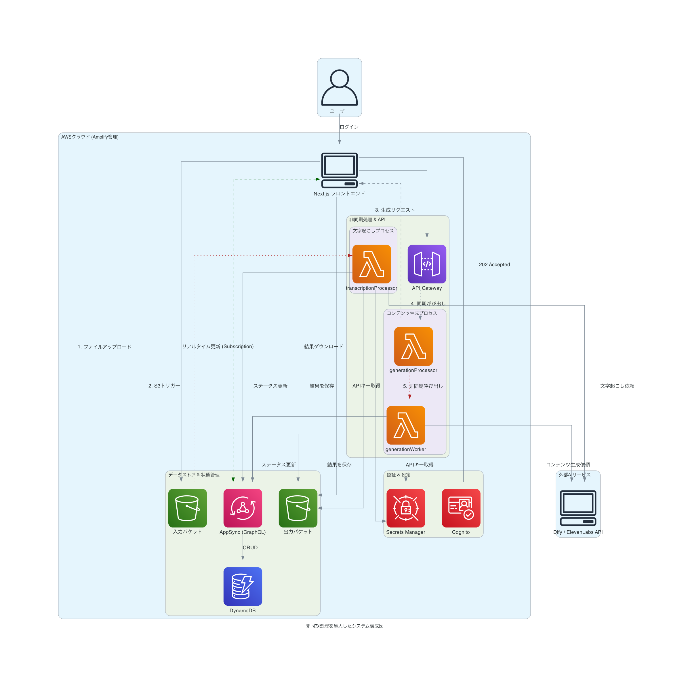

# 「文字起こしツール」システム説明資料

## 1. システム概要

「文字起こしツール」は、音声・動画ファイルをアップロードして自動的に文字起こしを行い、さらに議事録や箇条書き要約を生成できるウェブアプリケーションです。主に会議、インタビュー、講演などの録音・録画から効率的に文字情報を抽出し、整理するために設計されています。

## 2. 主要機能の詳細実装

### 2.1 音声・動画ファイルの文字起こし（中間JSON＋音声プレビュー対応）
- **サポートファイル形式**: MP3, M4A, WAV, MP4, OGG, AAC, WEBM, FLAC形式のファイルをサポート
- **多言語対応**:
  - 日本語（デフォルト）と英語での文字起こしに対応
  - ユーザーがUIから文字起こし言語を選択可能
  - 前回使用した言語設定をローカルストレージに保存し、次回のデフォルト設定として使用
- **アップロードと文字起こしのフロー**:
  1.  **フロントエンド (`MediaUploader.tsx`)**: ユーザーがファイルをアップロードすると、`createProcessingSession`ミューテーションを実行して`ProcessingSession`レコードを作成し、ステータスを`UPLOADED`に設定します。同時に、ファイルをS3の**入力用バケット**にアップロードします。
  2.  **S3トリガー**: ファイルのアップロードをトリガーとして、`transcriptionProcessor` Lambda関数が自動的に起動します。
3.  **Lambda (`transcriptionProcessor`)**:
      -   `ProcessingSession`のステータスを`PROCESSING_TRANSCRIPTION`に更新。
      -   Secrets ManagerからAPIキーを取得し、外部の文字起こしAPI (ElevenLabs/Dify) を呼び出し。
      -   ElevenLabsの`words`配列を含む中間JSON（タイムスタンプ・話者IDを含む）をS3に保存し、同時に`ProcessingSession.transcriptFormat=JSON`を設定。
      -   ステータスを`PENDING_SPEAKER_EDIT`に更新し、処理を完了。
  4.  **フロントエンド (`TranscriptionResult.tsx`)**: AppSync Subscriptionを通じてステータスの変更をリアルタイムに検知し、UIを更新します（例: スピナー表示、結果表示）。

### 2.2 話者認識と話者名編集（個別編集・音声プレビュー）
- **データ形式**: 文字列ベースから、中間JSON（`words: { text, start, end, speaker_id }[]`）ベースに移行。
- **個別編集**: 同一`speaker_id`の連続単語をUI上でセグメント化し、ブロック単位で話者変更。
- **音声プレビュー**: セグメントクリックで`start-end`区間を再生。音声URLは`getAudioPresignedUrl`で取得。
- **保存形式**: 編集完了で可読性の高いプレーンテキストを生成しS3に上書き。同時に`transcriptFormat=TEXT`に更新。再編集不可の注意をUIに表示。
- **話者カラー**: 固定パレットを継続。

### 2.3 AI生成機能（選択式 + 非同期二段Lambda）
- **箇条書き・議事録の生成フロー**:
  1.  **フロントエンド (`TranscriptionResult.tsx`)**: ユーザーが話者編集済みのテキストを元に「生成」ボタンをクリックします。
2.  フロントエンドはチェックボックス選択に基づき、API Gatewayの単一エンドポイント (`/generate/process-all`) に `processingTypes` を付与して送信。タスク一覧生成時は追加2ファイルも送信。
  3.  **API Gateway**: リクエストを受け付け、エンドポイント用Lambda (`generationProcessor`) を同期的に呼び出します。
  4.  **エンドポイントLambda (`generationProcessor`)**:
      -   リクエストを検証し、後続のワーカーLambda (`generationWorker`) を**非同期**で呼び出します。
      -   呼び出し後、即座に`202 Accepted`レスポンスをフロントエンドに返します。これにより、フロントエンドは長時間の応答待ちから解放されます。
5.  **ワーカーLambda (`generationWorker`)**:
      -   選択された種類のみ生成を実行。
      -   処理の各段階（処理中、成功、失敗）で`ProcessingSession`のステータスをAppSync経由で更新します。
      -   生成されたテキストやファイルは、それぞれS3の**出力用バケット**に保存されます。
      -   全ての処理が成功すると、最終ステータスを`ALL_COMPLETED`に更新します。
  6.  **フロントエンド**: AppSync Subscriptionを通じてリアルタイムにステータス変更を検知し、UI（進捗表示、結果表示、ボタンの有効/無効化など）を動的に更新します。

### 2.4 ファイル管理（削除のLambda移管と定期クリーンアップ）
- **一括ダウンロード実装**:
  - 関数: `useFileDownload`フック内で実装
  - 使用ライブラリ: JSZip + file-saver
  - ファイル命名規則:
    - ZIP: `${safeFileName}_生成ファイル.zip`
    - 中身: `文字起こし_${safeFileName}.txt`, `箇条書き_${safeFileName}.txt`, `議事録_${safeFileName}.txt`, `タスク一覧_${safeFileName}.xlsx`
  - ファイル名サニタイズ: 不正文字をアンダースコアに置換
- **S3ファイル削除（オンデマンド）**:
  - タイミング: 一括ダウンロード完了後にGraphQLミューテーション`deleteGeneratedFiles`を呼び出し、Lambdaが検証・削除を実行。
  - 権限: 出力バケットはカスタムS3のため、各Lambdaの`custom-policies.json`に`DeleteObject/DeleteObjects/ListBucket`を明示付与。
- **定期クリーンアップ**:
  - 仕組み: `cleanupExpiredFiles`をEventBridgeスケジュールで実行し、`updatedAt`から一定時間（例:2時間）経過したセッションの関連S3ファイルを自動削除（ProcessingSessionレコードは保持）。

### 2.5 認証と組織管理（残時間・回数制限・月次リセット）
- **ユーザー認証**:
  - 実装: AWS Cognito + Amplify Auth
  - フロー: Amplify Authenticator UI → fetchAuthSession → ユーザー情報取得
  - ユーザー識別: userSubをユーザーIDとして使用
  - ユーザーグループ: Admin/Users（`amplify/backend/auth/userPoolGroups`で定義）
- **組織管理**:
  - データスキーマ: GraphQL API (AppSync)で管理
  - クエリ: `listOrganizations`でユーザーの所属組織検索
  - 組織ID解決: 組織名を使ってクエリし、内部IDを取得（`fetchRealOrganizationId`関数）
- **利用時間管理**:
  - 追跡: 処理音声長と組織残り時間の比較
  - 条件判定: `isExceedingRemainingTime`フラグで利用可否を判断
  - 更新API: アトミック減算用の`decreaseOrganizationRemainingMinutes`ミューテーションに統一
- **タスク生成回数制限**:
  - `remainingTaskGenerations`を導入。`TASKS_COMPLETED`で`decreaseOrganizationTaskGenerations`により減算。
  - フロントで残回数表示とチェックボックスの無効化制御を実装。
- **月次リセット**:
  - `monthlyReset`（スケジュール実行）にて`remainingMinutes`と`remainingTaskGenerations`をそれぞれ`monthlyMinutes`/`monthlyTaskGenerations`にリセット。

### 2.6 メンテナンスモード
- **機能概要**: 
  - システムの一時的な全機能停止を環境変数で制御
  - ユーザーには停止理由を通知するメッセージを表示
  - ログイン後の画面でのみ表示（認証は維持）
- **実装**:
  - コンポーネント: `MaintenanceNotice.tsx`でメンテナンス通知を実装
  - 環境変数: `NEXT_PUBLIC_MAINTENANCE_MODE`と`NEXT_PUBLIC_MAINTENANCE_MESSAGE`
  - 条件付きレンダリング: メインコンポーネント内で停止状態を判定
- **動作フロー**:
  1. ユーザーがログイン
  2. 環境変数の値を確認
  3. `MAINTENANCE_MODE`が`true`の場合、メインコンテンツの代わりにメンテナンス通知を表示
  4. メンテナンス中でもログアウトは可能

## 3. 技術スタック

### 3.1 フロントエンド
- **フレームワーク**: Next.js (React)
- **UI/UX**: カスタムCSSモジュール
- **状態管理**: 
  - Zustand (クライアント状態管理)
  - TanStack Query (サーバー状態管理)
- **ダークモード対応**: メディアクエリによる自動検出

### 3.2 バックエンド
- **クラウドサービス**: AWS Amplify
- **認証**: AWS Cognito
- **データベース & API**: AWS AppSync (GraphQL), AWS API Gateway (REST)
- **ストレージ**: Amazon S3
- **サーバーレス関数**: AWS Lambda（`generationProcessor`/`generationWorker`の二段構成、`cleanupExpiredFiles`、`monthlyReset`、`deleteGeneratedFiles`、`getAudioPresignedUrl` など）
- **シークレット管理**: AWS Secrets Manager

### 3.3 AI/ML機能
- **文字起こし処理**: 
  - ElevenLabs API: 音声認識・文字起こし処理
  - Dify API: ワークフロー形式での文字起こしオプション
- **生成AI**: Dify APIを通じたGPTベースのテキスト生成モデル（箇条書き・議事録生成、及び3つのファイルを入力としたタスク一覧生成）

## 4. システムアーキテクチャと詳細なデータフロー

### システム全体構成図

*(この図は`docs/create_architecture_diagram.py`スクリプトによって生成されます)*

### データフロー詳細説明

1.  **認証**: ユーザーはNext.jsフロントエンドを通じてCognitoで認証されます。
2.  **文字起こしフロー**:
    -   ユーザーがファイルをアップロードすると、ファイルは**S3入力バケット**に保存されます。
    -   S3イベントが`transcriptionProcessor` Lambdaをトリガーします。
    -   LambdaはSecrets ManagerからAPIキーを取得し、外部AIサービスを呼び出して文字起こしを実行します。
    -   結果のテキストは**S3出力バケット**に保存され、処理ステータスはAppSync経由でDynamoDBに記録されます。
3.  **コンテンツ生成フロー**:
    -   ユーザーがチェックボックスで生成対象を選択後、**API Gateway**の単一エンドポイントに送信。
    -   `generationProcessor` が受け付け、`generationWorker` を非同期起動（`202 Accepted`を即時返却）。
    -   `generationWorker` は指定の種類のみ生成。タスク一覧は追加2ファイルを使用。
    -   結果は**S3出力バケット**に保存され、ステータスは同様にAppSync経由で更新されます。
4.  **UI更新**: フロントエンドはAppSync Subscriptionを利用して、これらのバックグラウンド処理の進捗をリアルタイムに監視し、UIを動的に更新します。
5.  **ダウンロードとファイル削除**:
    -   一括ダウンロード後に`deleteGeneratedFiles`ミューテーションを呼び出し、Lambdaが認可検証の上でS3出力バケットの関連ファイル（文字起こし、箇条書き、議事録、タスク一覧）を削除します。別途、`cleanupExpiredFiles` が一定時間経過分を定期削除します。

## 5. 処理フロー

1. **認証**: ユーザーログイン・認証
2. **ファイルアップロード**: 音声/動画ファイルの選択とアップロード
3. **文字起こし**: ファイルの音声データからテキスト生成
4. **話者名編集**: 認識された話者への名前付け
5. **コンテンツ生成**: 箇条書きと議事録の自動生成
6. **結果表示**: 生成されたすべてのコンテンツを表示
7. **ダウンロード**: ファイルのダウンロードと処理完了

## 6. ユーザー権限とロール

- **通常ユーザー**: 文字起こし処理、組織の利用時間内でのサービス利用
- **管理者**: ユーザー管理、組織管理、利用時間の設定

## 7. データモデル詳細

### User (AWS Cognito)
- ID
- メールアドレス
- ユーザー名
- 所属グループ (Admin/Users)

### Organization (GraphQL/AppSync)
- ID
- 名前
- 残り利用時間 (remainingMinutes)
- 残りタスク生成回数 (remainingTaskGenerations)
- 月次リセット値（時間）(monthlyMinutes)
- 月次リセット値（タスク回数）(monthlyTaskGenerations)
- 管理者ユーザーID (複数可)
- メンバーユーザーID (複数可)

### ProcessingSession (GraphQL/AppSync)
- ID (UUID v4で生成)
- userID (所有者)
- organizationID
- **status**: `UPLOADED`, `PROCESSING_TRANSCRIPTION`, `PENDING_SPEAKER_EDIT`, `TRANSCRIPTION_FAILED`, `SPEAKER_EDIT_COMPLETED`, `PROCESSING_BULLETS`, `BULLETS_COMPLETED`, `BULLETS_FAILED`, `PROCESSING_MINUTES`, `MINUTES_COMPLETED`, `MINUTES_FAILED`, `PROCESSING_TASKS`, `TASKS_COMPLETED`, `TASKS_FAILED`, `ALL_COMPLETED`, `ERROR`
- transcriptKey (S3のファイルキー)
- bulletPointsKey (箇条書きファイルのS3キー)
- minutesKey (議事録ファイルのS3キー)
- taskFileKey: String          # ユーザーがアップロードしたタスク定義ファイル(task.xlsx)のS3キー
- informationFileKey: String   # ユーザーがアップロードした関連情報ファイル(information.xlsx)のS3キー
- tasksKey: String             # Difyが生成したタスク一覧ファイル(xlsx)のS3キー
- transcriptFormat: JSON | TEXT
- createdAt
- expiresAt (24時間後に設定)
- (その他、`language`, `fileName`など)

## 8. 開発環境

- **環境変数**: API接続などの設定
- **デプロイメント**: AWS Amplifyを使用した簡易デプロイ
 - **メンテナンスモード**:
  - 環境変数で機能を一時停止: `NEXT_PUBLIC_MAINTENANCE_MODE=true`
  - カスタムメッセージの設定: `NEXT_PUBLIC_MAINTENANCE_MESSAGE=カスタムメッセージ`
  - 各環境（開発/テスト/本番）ごとに個別設定可能

## 9. 今後の拡張予定

- プロンプトに会議情報を付加できる設定の実装
- 個別編集モードの完全実装（現状は保存で再編集不可）
- タスク一覧修正機能の実装
- RapidFuzz などを使用した、誤字修正機能の実装
- 話者編集をAIが行うモードの実装
- 話者識別を行わない設定の追加

## 10. セキュリティと個人情報

- ユーザー認証によるデータ保護
- S3バケットへのアクセスはIAMポリシーによって厳格に管理
- APIキーはAWS Secrets Managerで安全に保管され、Lambda関数からのみアクセス可能
- 組織単位でのデータ分離
- プライバシー保護のため、ダウンロード後のS3ファイルはフロントエンドから削除される

本システムは、会議や音声コンテンツの効率的な文書化を支援し、重要な情報の抽出と共有を容易にします。継続的な機能強化を通じて、より高度な文字起こしと情報整理のニーズに応えていきます。 